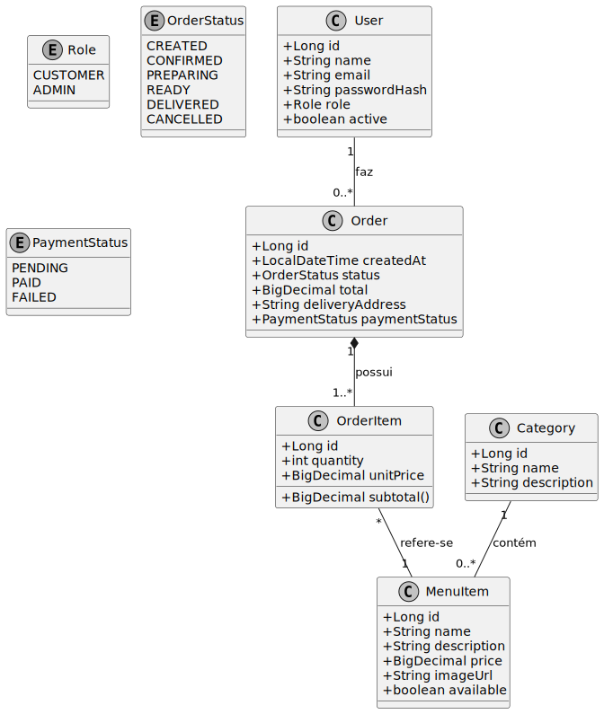

# Lanchonete App

Projeto backend em Spring Boot com front-end em Thymeleaf para uma lanchonete: cardápio, pedidos e admin.

## Visão rápida
- **Stack:** Java + Spring Boot, Thymeleaf, JPA (H2 para dev, PostgreSQL para produção)
- **Objetivo:** MVP para aceitar pedidos online, gerenciar cardápio e visualizar pedidos.
## 📊 Estrutura do Projeto

 [ Diagrama atual](src/main/resources/static/diagrama.svg)

